# Effects Guide

Detailed descriptions of all 28 procedural lighting effects. Every effect runs indefinitely, never repeating the same pattern twice. Each has a companion `_config.py` file that can be edited while the effect is running for instant hot-reload.

All parameters listed below can also be tuned visually using the **Configure...** window from the system tray menu, which provides sliders, color pickers, and a live keyboard preview.

---

## Arc Sweep

**File:** `effects/arc_sweep.py` | **FPS:** 24

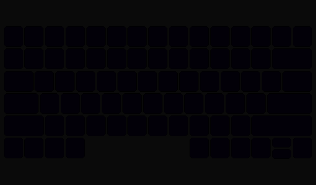

Luminous curved wavefronts sweep across the keyboard from random off-screen focal points, creating gently curved shockwave-like sweeps. Each arc has an asymmetric profile — sharp leading edge, broad trailing fade — with speed-dependent width (slow arcs thin, fast arcs widen). Domain warping via value noise distorts wavefronts organically, and chromatic edge-splitting adds prismatic fringe where blue leads and red trails. Multiple arcs can overlap, and an optional afterglow leaves warmth in their wake.

**Palette:** Green center with purple trail fade, prismatic chromatic fringe, dark purple background.

**Key config parameters:**
- `SPEED_MIN` / `SPEED_MAX` — sweep speed range
- `PAUSE_MIN` / `PAUSE_MAX` — delay between spawning arcs
- `FOCAL_DISTANCE` — curvature of the wavefront (larger = flatter)
- `ARC_WIDTH` — base Gaussian thickness of the arc
- `WARP_STRENGTH` / `WARP_SCALE` — domain warp for organic distortion
- `CHROMATIC_OFFSET` — prismatic color channel separation
- `COLORS` — list of arc colors (one picked randomly per arc)
- `TRAIL_COLOR` — color the arc fades into as it passes

---

## Lightning Strike

**File:** `effects/lightning_strike.py` | **FPS:** 15

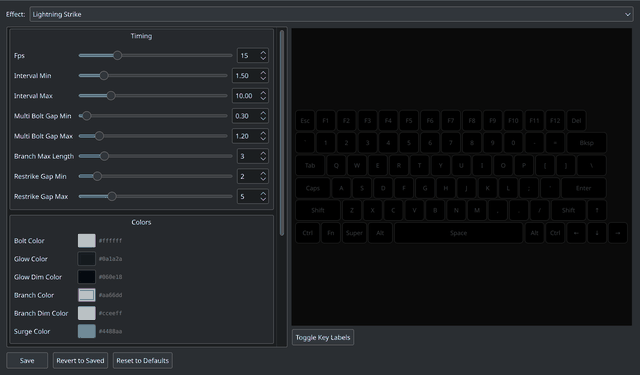

Procedural lightning bolts strike from the top of the keyboard to the bottom with realistic zigzag paths. Each bolt has a bright white core, purple branches that fork off at random rows, and a chance of restrikes and teal surge flickers. Multi-bolt storms can fire 2-3 bolts in quick succession. The timing mimics natural thunderstorm rhythm with randomized pauses between events.

**Palette:** White bolt core, purple branches, ice blue branch fade, teal surge, dark navy ambient glow.

**Key config parameters:**
- `INTERVAL_MIN` / `INTERVAL_MAX` — seconds between strikes
- `MULTI_BOLT_CHANCE` — chance of rapid successive bolts
- `BRANCH_CHANCE` — probability of branches at each row
- `RESTRIKE_CHANCE` — chance of a re-flash after the initial bolt
- `SURGE_CHANCE` — chance of a teal flicker after restrike

---

## Binary Cascade

**File:** `effects/binary_cascade.py` | **FPS:** 18

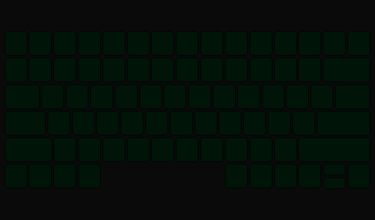

Matrix-style falling streams of green light. Each stream has a bright white head followed by a gradient trail from bright green through mid green to a dim green tail. Random cyan glints sparkle through the streams. Streams spawn independently across columns at varying speeds and trail lengths, creating a constant rain of digital characters.

**Palette:** White head, bright/mid/dim green trail, cyan glints, dark green background glow.

**Key config parameters:**
- `STREAM_SPAWN_CHANCE` — per-column per-frame spawn probability
- `MAX_STREAMS` — maximum simultaneous streams
- `SPEED_MIN` / `SPEED_MAX` — fall speed in cells per frame
- `TRAIL_LENGTH_MIN` / `TRAIL_LENGTH_MAX` — trail length range
- `GLINT_CHANCE` — probability of cyan sparkle per visible cell

---

## Tidal Swell

**File:** `effects/tidal_swell.py` | **FPS:** 20

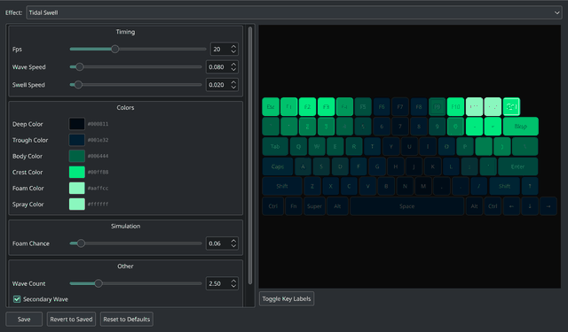

Ocean waves roll horizontally across the keyboard with realistic depth shading. The wave body transitions from deep ocean blues at the trough to bright green crests, topped with white-green foam and occasional white spray highlights. A secondary wave at a different frequency can overlay the primary wave for more complex motion. A slow vertical swell gives the whole scene a gentle breathing rhythm.

**Palette:** Deep ocean blue, trough blue-teal, green wave body, bright green crest, white-green foam, white spray.

**Key config parameters:**
- `WAVE_SPEED` — horizontal scroll speed
- `WAVE_COUNT` — number of wave crests across the keyboard
- `SWELL_SPEED` — vertical breathing speed
- `FOAM_CHANCE` — probability of foam sparkle at wave crests
- `SECONDARY_WAVE` — enable/disable overlay wave

---

## Plasma

**File:** `effects/plasma.py` | **FPS:** 20

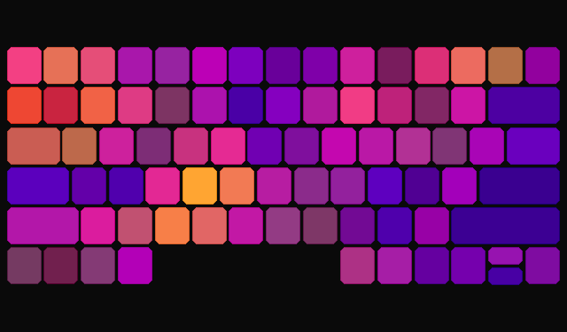

Classic demoscene plasma effect with layered sine waves at different frequencies and angles. Multiple sine functions combine to create organic, flowing color fields that drift across the keyboard. An optional second plasma layer with different parameters blends on top for added visual complexity. The orange-purple palette creates a warm, psychedelic atmosphere.

**Palette:** Deep orange through vivid lavender to deep purple (symmetric gradient).

**Key config parameters:**
- `SCALE_X` / `SCALE_Y` — spatial frequency of the plasma
- `TIME_SPEED` — animation speed in radians per frame
- `OVERLAY` — enable second plasma layer
- `OVERLAY_BLEND` — blend weight of the overlay (0 = none, 1 = full)

---

## Searchlight

**File:** `effects/searchlight.py` | **FPS:** 20

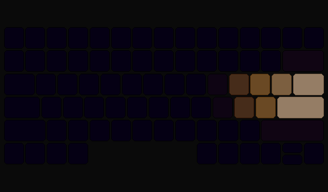

A rotating beam of light sweeps across a deep purple background, like a lighthouse or searchlight. The beam has a warm white/yellow core that fades through a warm glow to a green-tinted edge. Subtle brightness flicker adds realism. The beam origin and width are configurable, and the purple ambient background gives the whole keyboard a moody base tone.

**Palette:** Deep purple background, warm white/yellow core, warm glow mid, green-tinted edge.

**Key config parameters:**
- `SWEEP_SPEED` — rotation speed in radians per frame
- `BEAM_WIDTH` — angular width of the beam
- `BEAM_FALLOFF` — edge sharpness (higher = sharper cutoff)
- `ORIGIN_X` / `ORIGIN_Y` — beam pivot point
- `FLICKER` / `FLICKER_AMOUNT` — subtle brightness variation

---

## Glitch

**File:** `effects/glitch.py` | **FPS:** 15

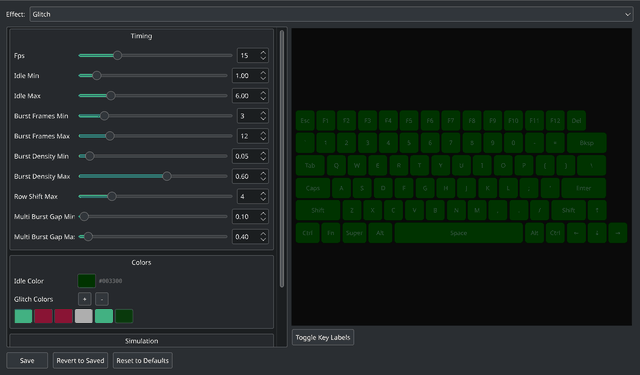

Alternates between a quiet dim-green baseline and violent glitch bursts. During bursts, random keys flash with bright green, hot pink, red, white, and cyan. Row-shift corruption displaces entire rows sideways, and bright horizontal scanlines cut across the display. Multi-burst chains can fire in rapid succession. The timing between bursts is randomized, creating a tense, unpredictable rhythm.

**Palette:** Dim green idle, with bursts of bright green, hot pink, red, white, and cyan.

**Key config parameters:**
- `IDLE_MIN` / `IDLE_MAX` — seconds between glitch bursts
- `BURST_FRAMES_MIN` / `BURST_FRAMES_MAX` — burst duration
- `BURST_DENSITY_MIN` / `BURST_DENSITY_MAX` — fraction of keys affected
- `CORRUPTION_CHANCE` — probability of row-shift per frame
- `SCANLINE_CHANCE` — probability of bright scanline per frame
- `MULTI_BURST_CHANCE` — chance of rapid successive bursts

---

## Corrupt

**File:** `effects/corrupt.py` | **FPS:** 15

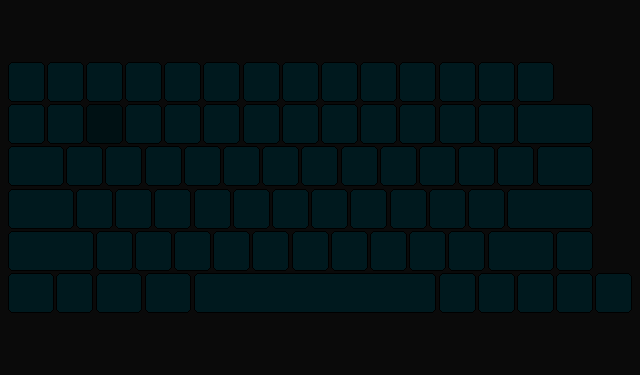

Localized corruption zones erupt across an otherwise calm keyboard, like bad memory sectors on a failing display. Small rectangular patches of digital noise, row-shifts, scanlines, and solid color blocks spawn at random positions and live for a few frames before fading out. Each patch style has distinct character — noise scatters random cyberpunk-colored pixels, shift displaces rows sideways, scanlines draw bright horizontal streaks, and block fills a stuck region with a single glitch color. Patches fade in and out smoothly over their lifetime. The rest of the keyboard stays dark teal with subtle random shimmer.

**Palette:** Dark teal idle baseline with cyberpunk corruption bursts: hot magenta, electric cyan, white, neon purple, acid green, hot orange.

**Key config parameters:**
- `IDLE_COLOR` — baseline keyboard color between corruption events
- `SPAWN_CHANCE` — probability of spawning a new patch per frame
- `MAX_PATCHES` — maximum simultaneous corruption zones
- `PATCH_WIDTH_MIN` / `PATCH_WIDTH_MAX` — patch width range in columns
- `PATCH_HEIGHT_MIN` / `PATCH_HEIGHT_MAX` — patch height range in rows
- `PATCH_LIFE_MIN` / `PATCH_LIFE_MAX` — patch lifetime in frames
- `GLITCH_COLORS` — list of RGB colors used for corruption pixels

---

## Fractal Zoom

**File:** `effects/fractal_zoom.py` | **FPS:** 15

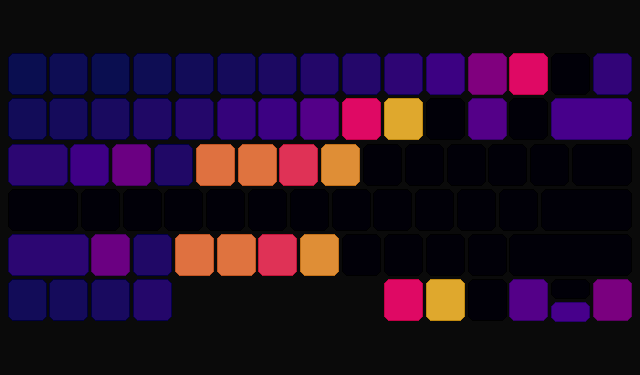

Continuously zooms into a Mandelbrot or Julia set fractal, rendered in a purple nebula palette. The view slowly rotates as it zooms, revealing new detail at each level. A breathing pulse modulates brightness for added life. When the zoom reaches its limit, it resets and begins again from a new perspective. Supports switching between Mandelbrot and Julia modes via config.

**Palette:** Near-black purple through deep purple to vivid magenta (symmetric nebula gradient).

**Key config parameters:**
- `ZOOM_SPEED` — zoom progression per frame
- `ZOOM_RANGE` — total zoom depth before reset
- `ROTATION_SPEED` — slow rotation in radians per frame
- `MAX_ITER` — iteration depth (detail vs. performance)
- `JULIA_MODE` — switch between Mandelbrot and Julia sets
- `PULSE` / `PULSE_SPEED` — breathing brightness modulation

---

## Lissajous

**File:** `effects/lissajous.py` | **FPS:** 24

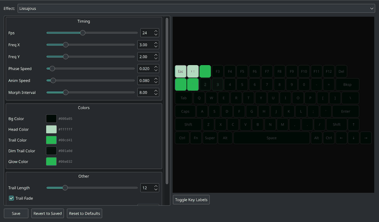

A bright dot traces Lissajous curves across the keyboard, leaving a fading green trail behind it. The curve shape morphs over time as frequencies and phase shift gradually, so the pattern never settles into a static loop. A soft glow surrounds the dot head. Periodically, the frequencies jump to new values for fresh shapes.

**Palette:** Dark background, white dot head, green trail fading to dim green, green glow.

**Key config parameters:**
- `FREQ_X` / `FREQ_Y` — Lissajous frequency ratio
- `PHASE_SPEED` — phase shift speed (controls shape morphing)
- `ANIM_SPEED` — dot travel speed along the curve
- `TRAIL_LENGTH` — number of trailing dots
- `GLOW_RADIUS` — radius of glow around the dot
- `MORPH` / `MORPH_INTERVAL` — periodic frequency randomization

---

## Heat Diffusion

**File:** `effects/heat_diffusion.py` | **FPS:** 20

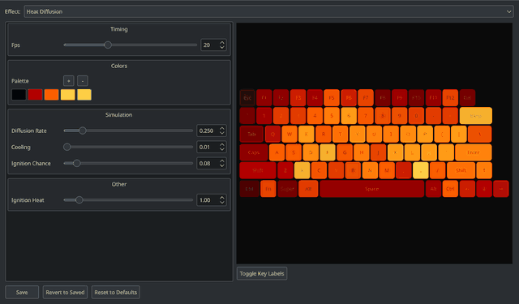

A thermal simulation where rare ignition events spawn glowing embers that inject heat over several frames. Heat spreads to neighboring cells via discrete Laplacian diffusion (with multiple substeps per frame for smooth propagation) while the entire grid slowly cools. The result is mapped to a hot iron palette that transitions from cool blue through red and orange to yellow and white. You see individual hot spots bloom outward, their heat pools spreading and merging before gradually fading as cooling wins out.

**Palette:** Cool blue base → dark red → orange → yellow → white (hot iron).

**Key config parameters:**
- `DIFFUSION_RATE` — heat spread speed (0.25 = stable diffusion)
- `SIM_STEPS` — diffusion substeps per frame (smoother spreading)
- `COOLING` — global cooling per frame
- `IGNITIONS_PER_SEC` — average new hotspot events per second
- `EMBER_DURATION` — frames each ember burns before extinguishing
- `IGNITION_HEAT` — temperature of new ignitions

---

## Metaballs

**File:** `effects/metaballs.py` | **FPS:** 24

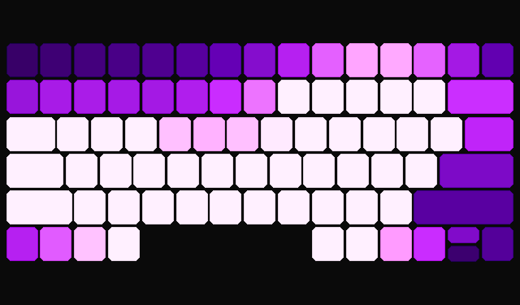

Molten lava blobs drift on Lissajous paths across the keyboard. Each blob generates a scalar field (radius²/distance²), and where fields overlap the blobs appear to merge organically. The field value is mapped through a lava palette: dark edges glow red, the fringe turns orange, and merged cores blaze yellow-white. Aspect ratio correction accounts for non-square key spacing.

**Palette:** Black → dark red → red-orange → orange → yellow → yellow-white (molten lava).

**Key config parameters:**
- `NUM_BLOBS` — number of metaballs (up to 5)
- `BLOB_RADIUS` — radius affecting field strength
- `SPEED` — blob movement speed
- `ASPECT_RATIO` — horizontal/vertical key spacing ratio
- `THRESHOLD` — field value at the blob "surface"

---

## Chladni Patterns

**File:** `effects/chladni.py` | **FPS:** 20

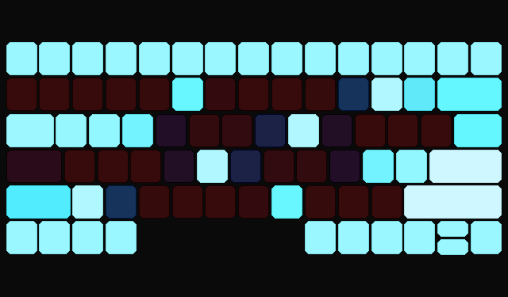

Visualizes the nodal lines of a vibrating plate — the Chladni figures from acoustics. The formula `a·sin(πnx)·sin(πmy) + b·sin(πmx)·sin(πny)` is evaluated with travelling-wave phase offsets so the nodal lines flow and ripple rather than sitting static. Mode pairs crossfade with smoothstep blending, and gradient-based edge glow brightens where the field changes steeply near nodal lines. Chromatic displacement offsets the R and B palette channels along the gradient for a prismatic fringe. A dual-frequency breathing pulse keeps the pattern alive. Rich multi-stop palettes map nodal lines through deep navy to white and anti-nodes through ember to gold.

**Palette:** Deep navy → cyan → white (nodal lines), ember → amber → gold (anti-nodes).

**Key config parameters:**
- `NODAL_WIDTH` — width of the bright nodal lines (Gaussian spread)
- `MORPH_SPEED` — crossfade speed between mode pairs
- `WAVE_SPEED` — travelling-wave phase animation speed
- `PULSE_SPEED` — breathing pulse frequency
- `EDGE_GLOW` — gradient-based edge brightness boost
- `CHROMATIC_SPREAD` — R/B channel displacement intensity
- `MODE_PAIRS` — list of (n, m) mode pairs to cycle through
- `NODAL_PALETTE` / `ANTINODE_PALETTE` — multi-stop color gradients

---

## Cyclic Cellular Automaton

**File:** `effects/cyclic_cellular.py` | **FPS:** 12

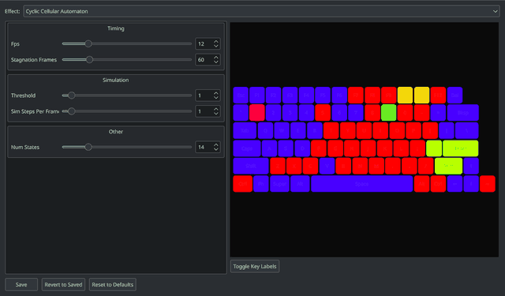

A grid of cells cycles through 8 states. Each step, a cell advances to the next state if any of its 8 neighbors (Moore neighborhood) already holds that successor state. Starting from random noise, this simple rule produces emergent rotating spirals and traveling waves. Wavefront glow tracks recently transitioned cells — they flash bright and decay, making spiral arms' leading edges pop dramatically. Edge detection highlights cells on state boundaries with extra brightness, creating neon-outlined spiral structure. Interior cells sit dimmer, giving strong visual depth. If the automaton stagnates, it re-seeds with a bright flash.

**Palette:** 8-color jewel tones (amethyst → indigo → sapphire → aquamarine → emerald → topaz → fire opal → ruby).

**Key config parameters:**
- `NUM_STATES` — number of states in the cycle (changes palette size)
- `THRESHOLD` — minimum neighbors required to advance
- `SIM_STEPS_PER_FRAME` — simulation steps per rendered frame
- `STAGNATION_FRAMES` — frames without change before re-seed
- `GLOW_DECAY` — wavefront glow fade rate per frame
- `GLOW_INTENSITY` — brightness boost for recently transitioned cells
- `EDGE_BRIGHTNESS` — brightness boost for cells on state boundaries
- `BASE_BRIGHTNESS` — brightness floor for interior cells

---

## Magnetic Field Lines

**File:** `effects/magnetic_field.py` | **FPS:** 20

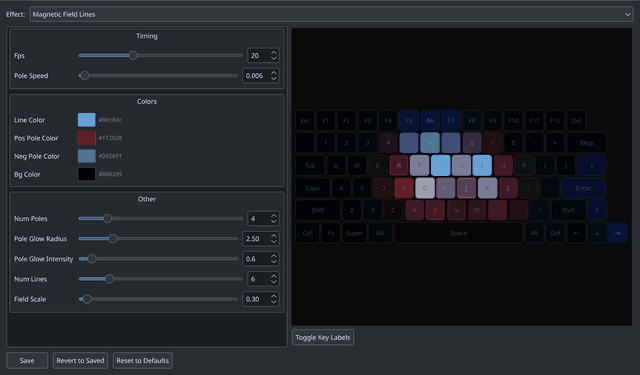

Four magnetic poles (alternating positive and negative charges) drift across the keyboard on Lissajous paths. At each pixel, the total magnetic field vector is computed from all poles, then visualized as animated iron filings: the pattern `|sin(N·angle + potential + flow_phase)|` flows along field lines using the scalar magnetic potential as a spatial phase offset, so filings stream from positive to negative poles. A soft ambient glow proportional to field strength fills in between the filing lines. Poles glow with Gaussian halos. When poles pass close to each other, the field topology snaps dramatically.

**Palette:** Dark background, green-cyan field lines with polarity tinting, red positive pole glow, blue negative pole glow.

**Key config parameters:**
- `NUM_POLES` — number of magnetic poles
- `POLE_SPEED` — drift speed of poles
- `NUM_LINES` — number of field line bands (controls pattern density)
- `FIELD_SCALE` — brightness scaling of field magnitude
- `FLOW_SPEED` — iron filing flow animation speed
- `POLE_GLOW_RADIUS` / `POLE_GLOW_INTENSITY` — pole proximity glow

---

## Wave Interference

**File:** `effects/wave_interference.py` | **FPS:** 24

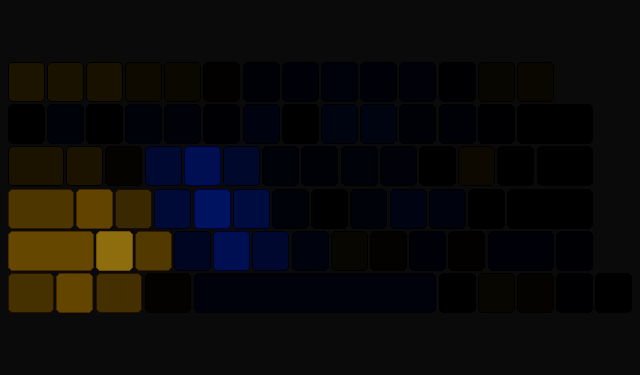

A 2D wave equation simulation with 3 moving point sources emitting sine waves. Waves propagate across the grid using Verlet integration with toroidal wrapping, interfering constructively and destructively as they wrap around. Damping prevents amplitude overflow. Sources inject broad wavefronts and drift on Lissajous-like paths, continuously changing the interference pattern. The diverging palette maps negative amplitudes to blue, zero to black, and positive amplitudes to gold.

**Palette:** Blue (negative) → black (zero) → gold (positive), diverging.

**Key config parameters:**
- `SPEED` — wave propagation speed
- `DAMPING` — amplitude damping per step (prevents blowup)
- `AMPLITUDE` — source injection strength
- `NUM_SOURCES` — number of emitting point sources
- `WAVE_FREQ` — emission frequency
- `SOURCE_SPEED` — how fast sources drift across the grid

---

## Fireflies

**File:** `effects/fireflies.py` | **FPS:** 20

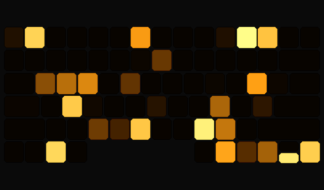

Each key is an independent oscillator with its own natural frequency, coupled to its neighbors via the Kuramoto model. The coupling strength oscillates slowly over time, causing the system to cycle between synchronized flashing (all keys fire together) and chaotic independent blinking. Each oscillator's brightness is a sharp flash — `max(0, sin(phase))^sharpness` — mimicking the brief blink of a firefly. The palette transitions from dark green through yellow-green to a bright white flash at peak.

**Palette:** Dark green (dim) → yellow-green (mid) → bright yellow-green → white (flash peak).

**Key config parameters:**
- `MEAN_FREQ` — average oscillation frequency
- `FREQ_SPREAD` — variation in natural frequencies
- `COUPLING` — maximum coupling strength (K)
- `COUPLING_SPEED` — how fast coupling oscillates (sync/chaos cycle rate)
- `FLASH_SHARPNESS` — exponent controlling flash brevity (higher = sharper)

---

## Crystal Growth

**File:** `effects/crystal_growth.py` | **FPS:** 12

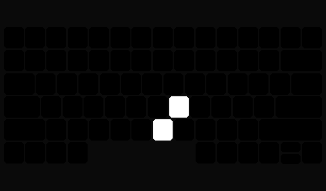

Diffusion-Limited Aggregation (DLA) grows a crystal from a single seed at the center of the keyboard. Random walkers spawn from the edges and drift randomly; when one touches the crystal (8-connected), it sticks and becomes part of the structure. Growth is capped to one attachment per frame for visible progression. Each cell is colored by its attachment order through a blue-teal-green-amber-red palette, with a brief white flash when it first attaches. When the crystal exceeds 55% fill, it resets and grows anew.

**Palette:** Blue (early growth) → teal → green → amber → red (late growth), with white flash on attachment.

**Key config parameters:**
- `MAX_WALKERS` — number of active random walkers
- `WALK_STEPS` — random walk steps simulated per frame
- `MAX_ATTACH_PER_FRAME` — cap on new crystal cells per frame
- `FILL_THRESHOLD` — fraction of grid filled before reset
- `FLASH_FRAMES` — duration of white flash on new attachment

---

## Reaction-Diffusion

**File:** `effects/reaction_diffusion.py` | **FPS:** 20

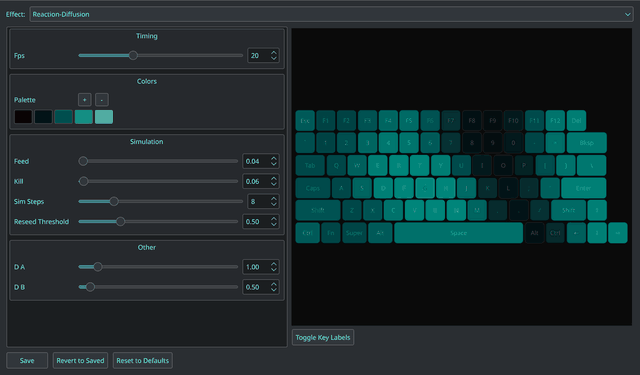

Two chemicals (A and B) interact via the Gray-Scott reaction-diffusion equations, producing organic cell-like patterns that split, pulse, and reform endlessly. Chemical A fills the grid while B is seeded in small patches. The reaction `A + 2B → 3B` creates autocatalytic growth, balanced by feed and kill rates. A weighted 9-point Laplacian with toroidal wrapping handles diffusion. The mitosis parameter set (f=0.0367, k=0.0649) produces self-replicating spots. Chemical B concentration maps to a bioluminescent teal-cyan palette. If B dies out, the system re-seeds automatically.

**Palette:** Black → dark teal → teal → bright cyan-teal → cyan-white (bioluminescent).

**Key config parameters:**
- `FEED` — feed rate of chemical A (controls pattern type)
- `KILL` — kill rate of chemical B (controls pattern type)
- `D_A` / `D_B` — diffusion rates (B diffuses slower than A)
- `SIM_STEPS` — simulation iterations per rendered frame
- `RESEED_THRESHOLD` — minimum B sum before automatic re-seed

---

## Physarum

**File:** `effects/physarum.py` | **FPS:** 20

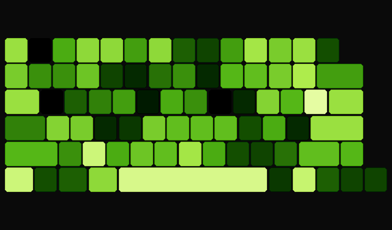

A slime mold (Physarum polycephalum) simulation. 120 agents wander a high-resolution internal buffer (4x the keyboard resolution), each with three forward-facing sensors. Agents sense the trail map ahead and steer toward higher concentrations, depositing their own trail as they move. A small random angle jitter each step prevents permanent convergence into a single blob. The trail map diffuses (3x3 box blur) and decays each frame. Sqrt normalization compresses dynamic range to reveal subtle trail networks. The buffer is downsampled to keyboard resolution for display.

**Palette:** Black → dark green → olive-green → bright yellow-green → bright yellow → pale yellow (bioluminescent).

**Key config parameters:**
- `NUM_AGENTS` — number of slime mold agents
- `SENSOR_ANGLE` — angle between sensors (radians)
- `SENSOR_DIST` — how far ahead agents sense
- `TURN_SPEED` — steering rate (radians per step)
- `DEPOSIT_AMOUNT` — trail deposited per step
- `DECAY_RATE` — trail decay multiplier per frame
- `BUFFER_SCALE` — internal buffer resolution multiplier
- `JITTER` — random angle perturbation per step (prevents convergence)

---

## Raindrop Ripples

**File:** `effects/raindrop.py` | **FPS:** 24

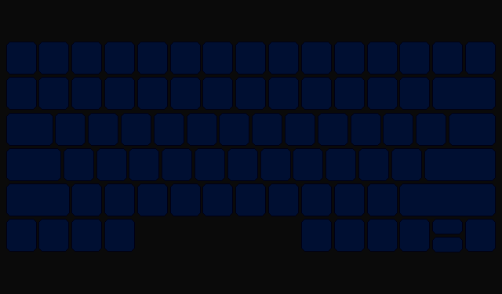

Raindrops land at random positions across the keyboard, spawning concentric ripple rings that expand outward with amplitude decay. Multiple concurrent ripples interfere constructively and destructively, creating evolving wave patterns on a dark moonlit water surface. Each impact flashes briefly with a bright splash highlight before the rings take over. The diverging palette maps wave troughs to deep midnight blue and crests to bright silver-white.

**Palette:** Deep midnight blue (calm) → dark blue (trough) → teal-blue (mid) → bright cyan-white (crest).

**Key config parameters:**
- `SPAWN_CHANCE` — probability of a new raindrop per frame
- `MAX_RIPPLES` — maximum concurrent ripples
- `EXPAND_SPEED` — ring expansion rate (cells per frame)
- `RING_FREQ` — tightness of concentric rings
- `RING_WIDTH` — Gaussian envelope width of each ring
- `DECAY_RATE` — how fast ripple amplitude dies
- `ASPECT_RATIO` — keyboard cell aspect correction
- `SPLASH_COLOR` — bright flash at impact point

---

## Ember Drift

**File:** `effects/ember.py` | **FPS:** 20

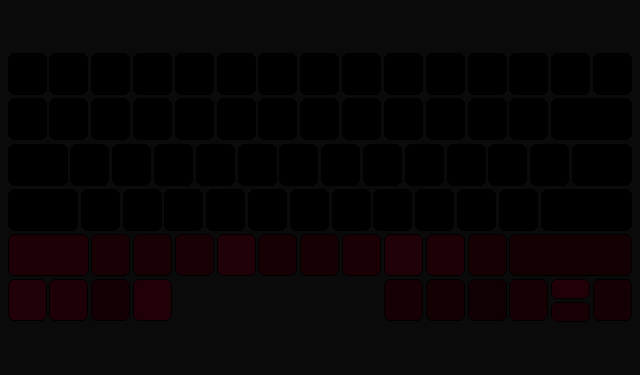

A particle system where hot embers spawn along the bottom edge of the keyboard and drift upward through lateral wind turbulence. Each particle cools as it rises, shifting from white-hot through orange to dark red before fading out. The bottom two rows shimmer with a smoldering ember bed glow that flickers randomly. Occasional bright sparks launch with double brightness and half lifespan, creating dramatic flare-ups.

**Palette:** Black → dark red → orange-red → orange → amber → yellow-white (hot ember gradient).

**Key config parameters:**
- `NUM_EMBERS` — maximum active particles
- `SPAWN_RATE` — new embers per frame (fractional = probability)
- `RISE_SPEED` — base upward drift speed
- `WIND_STRENGTH` — lateral wind amplitude
- `WIND_SPEED` — wind oscillation frequency
- `SPARK_CHANCE` — probability of a bright spark per frame
- `MAX_AGE` — frames before an ember dies
- `BED_GLOW` — bottom row ember bed brightness

---

## Heartbeat Pulse

**File:** `effects/heartbeat.py` | **FPS:** 30

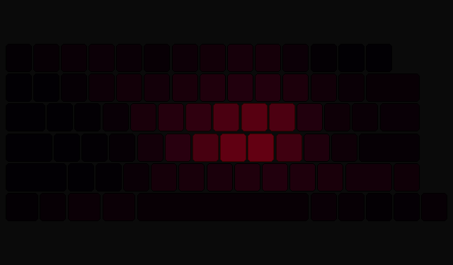

Simulates a beating heart with physiologically-inspired lub-dub cardiac rhythm. The S1 (lub) fires a broad, soft pressure wave; the S2 (dub) follows ~0.3 s later with a tighter, sharper ring — matching real cardiac timing. A phase accumulator ensures reliable double-beat timing even as BPM drifts. A systole flush subtly warms the whole keyboard during contraction. A faint vein network computed from Voronoi edges pulses in the background as waves pass through. BPM slowly oscillates between configurable limits for organic variation.

**Palette:** Deep plum → crimson → arterial red → bright red → soft pink (cardiac gradient, 8 stops).

**Key config parameters:**
- `BPM` — beats per minute (base rate)
- `BPM_MIN` / `BPM_MAX` — oscillation range for BPM variation
- `EXPAND_SPEED` — pulse ring expansion speed
- `RING_WIDTH` — Gaussian width of each pulse ring
- `LUB_STRENGTH` / `DUB_STRENGTH` — first and second beat amplitude
- `DUB_PHASE` — when the dub fires within the beat cycle (0.36 ≈ 0.3 s at 72 BPM)
- `CENTER_ROW` / `CENTER_COL` — pulse origin point
- `VEIN_BRIGHTNESS` — background vein network intensity
- `VEIN_PULSE` — how much veins brighten when a wave passes
- `SYSTOLE_FLUSH` — whole-keyboard warm tint during contraction

---

## Boid Flock

**File:** `effects/boids.py` | **FPS:** 20

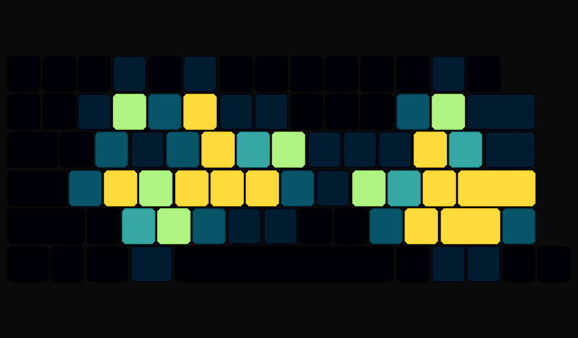

Autonomous boid agents follow Craig Reynolds' classic flocking rules — separation, alignment, and cohesion — creating emergent swarm behavior. Each boid deposits a glowing trail that fades over time, revealing the flock's movement patterns. Wall avoidance keeps the flock on-screen. Periodic startle events scatter the flock with random velocity impulses; they then gracefully re-form over the following seconds. The trail palette shifts from dark navy through teal to warm gold at boid positions.

**Palette:** Dark navy (empty) → teal (fading trail) → green → yellow-green → warm gold (fresh trail/boid).

**Key config parameters:**
- `NUM_BOIDS` — number of flocking agents
- `VISUAL_RANGE` — neighbor detection radius
- `SEPARATION_DIST` — minimum comfortable distance
- `W_SEPARATION` / `W_ALIGNMENT` / `W_COHESION` — flocking force weights
- `W_WALL` — wall avoidance force weight
- `TRAIL_DEPOSIT` / `TRAIL_DECAY` — trail brightness and fade rate
- `STARTLE_INTERVAL_MIN` / `STARTLE_INTERVAL_MAX` — frames between startle events
- `STARTLE_IMPULSE` — velocity kick magnitude

---

## Aurora Borealis

**File:** `effects/aurora.py` | **FPS:** 20

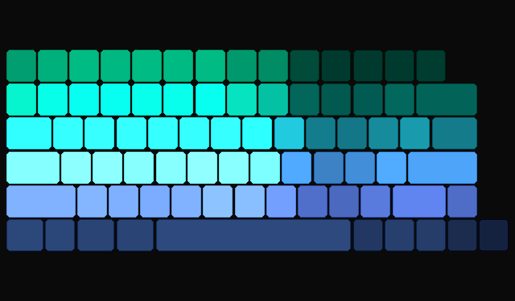

Multi-layer value noise creates shimmering aurora curtains dancing across the keyboard. Three color bands — green, cyan, and magenta — drift at different speeds with Gaussian vertical falloff, blended additively onto a dark night sky. Vertical curtain displacement creates the characteristic folding motion of real auroras. Two-octave fractal Brownian motion drives the organic flow. Occasional star twinkles flash briefly in the darker regions.

**Palette:** Dark night sky base with additive green, cyan, and magenta aurora bands. White star twinkles.

**Key config parameters:**
- `SCROLL_SPEED` — horizontal drift speed
- `CURTAIN_FREQ` — vertical fold frequency
- `CURTAIN_SPEED` — fold animation speed
- `FOLD_FACTOR` — how much rows affect fold phase
- `NOISE_SCALE` — spatial scale of the noise field
- `BAND_1_COLOR` / `BAND_2_COLOR` / `BAND_3_COLOR` — aurora layer colors
- `BAND_1_ROW` / `BAND_2_ROW` / `BAND_3_ROW` — vertical center of each band
- `STAR_CHANCE` — per-pixel per-frame chance of star twinkle

---

## Nebula Clouds

**File:** `effects/nebula.py` | **FPS:** 18

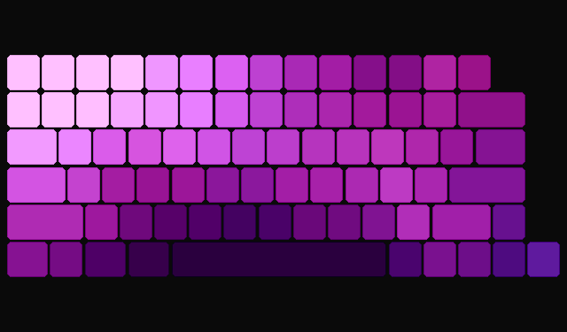

Deep space gas clouds with dual-layer fractal noise creating a sense of depth. A warm nebula layer (purple/magenta/pink) and cool accent clouds (dark blue/teal) drift at different speeds and angles for parallax. Three-octave fBm noise drives the warm layer while two-octave fBm handles the accents. Contrast boosting reveals dramatic cloud structure. Bright pixels within the nebula occasionally flash as newborn stars, adding sparkle to the cosmic scene.

**Palette:** Warm layer: black → deep purple → magenta → pink → lavender. Cool layer: black → dark blue → teal.

**Key config parameters:**
- `NOISE_SCALE_1` / `NOISE_SCALE_2` — spatial frequency of each layer
- `DRIFT_SPEED_1` / `DRIFT_SPEED_2` — drift speed (different for parallax)
- `DRIFT_ANGLE_1` / `DRIFT_ANGLE_2` — drift direction in degrees
- `ACCENT_STRENGTH` — blend weight of the cool accent layer
- `STAR_CHANCE` — per-pixel per-frame chance of star flash
- `STAR_THRESHOLD` — noise value above which stars can appear
- `PALETTE_WARM` / `PALETTE_COOL` — color stops for each layer

---

## Voronoi Shatter

**File:** `effects/voronoi.py` | **FPS:** 20

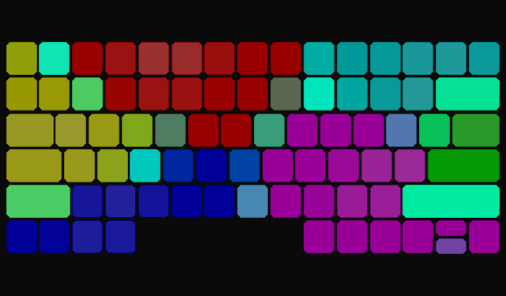

Moving seed points create a dynamic Voronoi diagram rendered as stained-glass cells with neon edge glow. Each cell is colored by its seed's slowly rotating HSV hue with distance-based saturation variation. Cell edges are detected where the nearest and second-nearest seed distances converge, creating bright neon outlines. Seeds drift via Brownian motion with soft mutual repulsion that keeps them spread across the keyboard. Periodic shatter events split a random seed into two, creating dramatic new fracture lines before merging back.

**Palette:** Per-cell HSV hues (evenly spaced) with configurable neon edge glow (default cyan).

**Key config parameters:**
- `NUM_SEEDS` — number of Voronoi seed points
- `SEED_SPEED` — maximum seed movement speed
- `SEED_JITTER` — Brownian motion jitter per frame
- `SEED_REPULSION` — soft repulsion force between seeds (prevents clumping)
- `HUE_SPEED` — per-frame hue rotation (degrees)
- `EDGE_WIDTH` — edge detection threshold (lower = thinner edges)
- `EDGE_COLOR` — neon edge glow color
- `EDGE_BRIGHTNESS` / `CELL_BRIGHTNESS` — edge and interior intensity
- `SHATTER_INTERVAL_MIN` / `SHATTER_INTERVAL_MAX` — frames between shatter events
- `SHATTER_DURATION` — frames the split lasts before merge

---

## Corruption

**File:** `effects/corruption.py` | **FPS:** 18

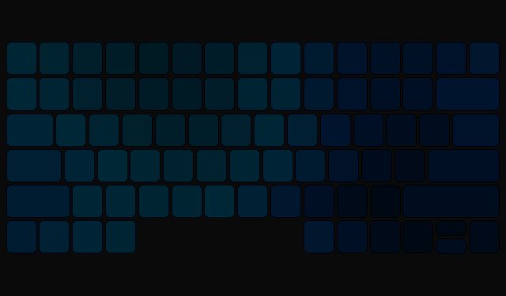

Organic digital decay that spreads across the keyboard like an infection. A calm breathing blue-teal gradient gets attacked by corruption sites that grow from random seed points with blobby, noise-modulated edges. Each infection follows a multi-phase lifecycle: incubation (single-pixel flicker warning), spread (blob expands outward), peak (maximum intensity with glitch artifacts), decay (contraction and healing), and scar (faint residual discoloration). At peak, sites can cascade — spawning child infections nearby. The corruption core renders dead pixels, white flashes, and channel swaps; the mid-zone shows hue shifts and sparks; the fringe glows with subtle warmth. Periodic power surges flare all active zones, and full-width scanline bleeds cut across the keyboard from high-intensity regions.

**Palette:** Blue-teal breathing baseline, hot magenta-pink corruption, green-tinted scars.

**Key config parameters:**
- `BASELINE_PALETTE` — breathing gradient colors for the healthy state
- `BASELINE_SPEED` — breathing animation speed
- `SPAWN_INTERVAL` — average seconds between new corruption sites
- `MAX_SITES` — maximum simultaneous corruption zones
- `RADIUS_MIN` / `RADIUS_MAX` — blob radius range in cells
- `INCUBATION_TIME` / `SPREAD_TIME` / `DECAY_TIME` / `SCAR_TIME` — lifecycle phase durations
- `PEAK_TIME_MIN` / `PEAK_TIME_MAX` — peak phase duration range
- `CORRUPT_COLOR` — hot magenta-pink corruption color
- `SCAR_COLOR` — healed area tint
- `CASCADE_CHANCE` — probability of spawning child sites at peak
- `SURGE_INTERVAL` — seconds between power-surge flares
- `ROW_BLEED_CHANCE` — chance per frame of full-width scanline bleed
