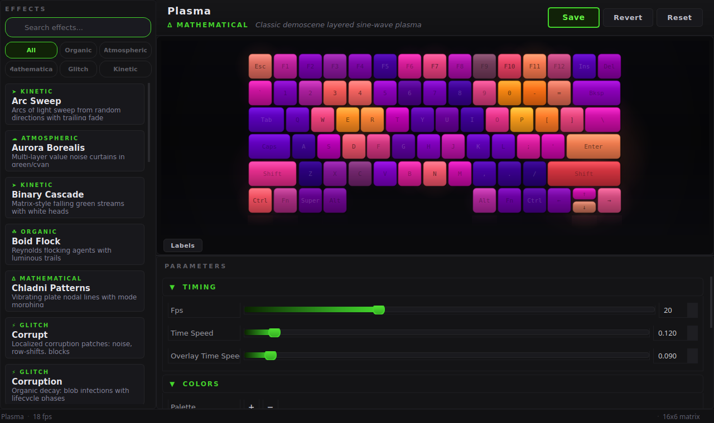

# Razer Lighting

Per-key RGB control for Razer laptop keyboards on Linux — 28 procedural effects that never repeat.

[](LICENSE)
[](https://www.python.org/)
[](https://openrazer.github.io/)



<p align="center">
  
  
</p>

> Every effect is procedurally generated and runs indefinitely. See all 28 with animated previews in the **[Effects Guide](EFFECTS.md)**.

## Features

- **28 procedural effects** — physics simulations, cellular automata, demoscene classics, and more, each infinitely unique
- **Plain Python scripts** — every effect is a standalone `.py` file; easy to read, modify, and create your own
- **Live configuration GUI** — tune every parameter with sliders, color pickers, and a real-time keyboard preview
- **Hot-reloadable configs** — edit `_config.py` files while effects run; changes apply instantly
- **System tray integration** — select effects, randomize, toggle autostart, all from the tray icon
- **Auto-discovery** — drop a new `.py` file in `effects/` and it appears in the menu automatically
- **GIF capture** — record any effect as an animated GIF for sharing or documentation

## Quick Start

```bash
git clone https://github.com/sl4ppy/RazerLighting.git
cd RazerLighting
python3 -m venv --system-site-packages .venv
.venv/bin/pip install pystray Pillow PyQt5 numpy
.venv/bin/python3 razer_lighting.py
```

A green circle appears in your system tray. Right-click it to select an effect. Your keyboard lights up immediately.

> **Requires:** Linux with [OpenRazer](https://openrazer.github.io/) installed, a Razer keyboard with per-key RGB support, and Python 3.10+.

## Hardware Compatibility

| Hardware | Support |
|---|---|
| Razer Blade 14 (2021+) | Tested, full per-key RGB |
| Other Razer laptops with per-key RGB | Should work (matrix dimensions auto-detected) |
| Razer external keyboards with per-key RGB | Should work via OpenRazer |
| Non-Razer keyboards | Not supported |

The keyboard matrix is auto-detected from OpenRazer. The configuration GUI keyboard layout is modeled on the Razer Blade 14 (6 rows × 16 columns) but effects render to whatever matrix size your device reports.

## Documentation

| Guide | Description |
|---|---|
| [Getting Started](docs/getting-started.md) | Installation, driver setup, and key concepts |
| [User Reference](docs/user-reference.md) | Complete feature and configuration reference |
| [Tutorials](docs/tutorials/index.md) | Step-by-step guides for effects and custom animations |
| [Troubleshooting & FAQ](docs/troubleshooting.md) | Common issues and how to fix them |
| [Glossary](docs/glossary.md) | RGB, LED, and tool-specific terminology |
| [Effects Guide](EFFECTS.md) | All 28 effects with animated previews and config parameters |
| [Creating Effects](CREATING_EFFECTS.md) | Developer guide for writing custom effects |

## Configuration

Open **Configure...** from the tray menu to launch the configuration window:


- **Effect gallery** — browse all 28 effects in a sidebar with search, category filters (Organic, Atmospheric, Mathematical, Glitch, Kinetic), and descriptions
- **Auto-generated controls** — sliders, spinboxes, color pickers, palette editors, and checkboxes inferred from each effect's config, in collapsible parameter groups
- **Live keyboard preview** — enhanced visualizer with per-key glow, 3D depth shading, ambient bloom, and desk reflection
- **Tooltips** — hover over any parameter for a description
- **Status bar** — live FPS counter, current effect name, matrix dimensions, and unsaved-changes indicator
- **Save / Revert / Reset** — changes only affect the preview until you Save

## Adding Effects

Every effect is a plain Python script. Drop a `.py` file in `effects/` with an `EFFECT_NAME` string and a `run(device, stop_event)` function, and it appears in the tray menu automatically.

```python
EFFECT_NAME = "My Effect"

def run(device, stop_event):
    while not stop_event.is_set():
        device.fx.advanced.matrix[0, 0] = (255, 0, 0)
        device.fx.advanced.draw()
```

See the **[Creating Effects Guide](CREATING_EFFECTS.md)** for the full walkthrough.

## Project Structure

```
razer_lighting.py            System tray app
config_window.py             PyQt5 configuration GUI with effect gallery and live preview
config_widgets.py            Parameter editor widgets (sliders, color pickers, etc.)
config_parser.py             AST-based config file parsing & writing
keyboard_layout.py           Keyboard layout data and key-rect computation
virtual_device.py            Virtual device for preview rendering
about_window.py              About dialog with branded visuals
device.py                    OpenRazer device connection with retry
capture_gif.py               Animated GIF capture tool
effects/
  ├── common.py              Shared utilities (palette, timing, discovery, grid math)
  ├── arc_sweep.py           Effect module (28 total)
  ├── arc_sweep_config.py    Hot-reloadable config
  └── ...
```

## Contributing

Contributions are welcome. To add a new effect, see the [Creating Effects Guide](CREATING_EFFECTS.md). For bug reports and feature requests, open an issue on GitHub.

## Support

<a href="https://www.buymeacoffee.com/chrisvd"></a>

## License

MIT
