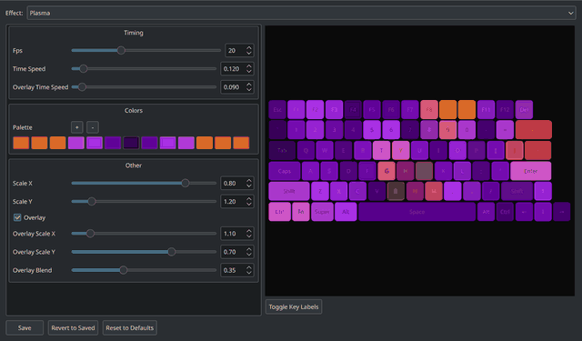
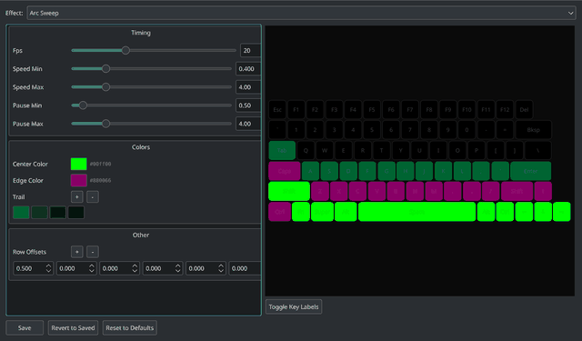

# Razer Lighting

Custom keyboard lighting effects for Razer laptops on Linux, powered by [OpenRazer](https://openrazer.github.io/). Runs as a system tray app with hot-reloadable, procedurally generated effects — no Polychromatic needed.

## Effects

All effects are procedurally generated — they never repeat the same pattern twice. See [EFFECTS.md](EFFECTS.md) for detailed descriptions and tunable parameters.

| Effect | Description |
|--------|-------------|
| **Arc Sweep** | Arcs of light sweep across the keyboard from random directions with variable speed and trailing fade. Multiple arcs can overlap simultaneously. |
| **Lightning Strike** | Procedural lightning bolts strike from top to bottom with zigzag paths, purple branches, restrikes, and teal surge flickers. Mimics natural thunderstorm rhythm. |
| **Binary Cascade** | Matrix-style falling streams of green light with bright white heads and fading trails. Random cyan glints sparkle through the streams. |
| **Tidal Swell** | Ocean waves roll across the keyboard with crests, foam sparkle, and depth-based color shading. |
| **Plasma** | Classic demoscene plasma with layered sine waves creating organic flowing color fields. Optional overlay layer for extra complexity. |
| **Searchlight** | A rotating beam sweeps across a purple background with warm white/yellow highlights. |
| **Glitch** | Alternates between a quiet baseline and violent burst corruption with row shifts and scanlines. |
| **Fractal Zoom** | Mandelbrot/Julia set zoom with a purple nebula palette. Continuously zooms into interesting regions. |
| **Lissajous** | A dot traces Lissajous curves with a fading trail. Frequencies morph over time for endless variation. |
| **Heat Diffusion** | Random hot spots ignite and heat spreads via discrete Laplacian diffusion with global cooling. Hot iron palette (black → red → orange → yellow → white). |
| **Metaballs** | Molten lava blobs drift on Lissajous paths, merging and splitting organically. Aspect-ratio-corrected field evaluation with a lava palette. |
| **Chladni Patterns** | Vibrating plate nodal line visualization. Azure lines on a dark background morph between mode pairs with a gentle breathing pulse. |
| **Cyclic Cellular Automaton** | 14-state automaton with Moore neighborhood produces self-organizing rainbow spiral waves from random noise. Auto-reseeds on stagnation. |
| **Magnetic Field Lines** | Iron filings pattern from 4 drifting magnetic poles. Cyan field lines with red/blue pole glows. Topology snaps as poles pass each other. |
| **Wave Interference** | 2D wave equation with 3 moving point sources. Waves propagate, reflect, and interfere in a diverging blue-black-gold palette. |
| **Fireflies** | Kuramoto coupled oscillators where each key flashes like a firefly. Coupling oscillates, cycling between synchronization and chaos. |
| **Crystal Growth** | Diffusion-limited aggregation grows a crystal from the center. Random walkers stick on contact, colored by growth order (blue → red). Resets at 55% fill. |
| **Reaction-Diffusion** | Gray-Scott model produces organic cell-like patterns that split, pulse, and reform. Bioluminescent teal-cyan palette. |
| **Physarum** | Slime mold simulation with 150 agents sensing and depositing trails on a high-res buffer. Self-organizing vein-like networks in yellow-green. |

## Installation

### Requirements

- Linux with [OpenRazer](https://openrazer.github.io/) daemon installed
- A Razer keyboard/laptop with per-key RGB (matrix) support
- Python 3.10+

### Setup

```bash
git clone <repo-url> ~/Projects/RazerLighting
cd ~/Projects/RazerLighting
python3 -m venv --system-site-packages .venv
.venv/bin/pip install pystray
```

The `--system-site-packages` flag is required so the venv can access the system-installed `openrazer` and GTK libraries.

## Usage

### Tray App

```bash
.venv/bin/python3 razer_lighting.py
```

A system tray icon appears with a menu to:
- **Select an effect** from all discovered effects
- **Random** — pick a random effect (persisted across restarts)
- **Reload Effect** — re-import the current effect module from disk
- **Configure...** — open the graphical configuration window
- **Start on Login** — toggle XDG autostart
- **Quit** — stop the effect, clear the keyboard, and exit

### Configuration Window

Open **Configure...** from the tray menu to launch the full configuration GUI:



- **Effect selector** — switch between all 19 effects
- **Per-effect parameter controls** — sliders, spinboxes, color pickers, palette editors, checkboxes, and list editors auto-generated from each effect's config file
- **Live keyboard visualizer** — realistic Razer Blade keyboard layout renders the effect in real time as you adjust parameters
- **Tooltips** — hover over any parameter for a description of what it controls
- **Save / Revert / Defaults** — changes only affect the preview until you click Save; Revert reloads from disk; Reset to Defaults restores original values




### Standalone Effects

Each effect can also be run directly:

```bash
.venv/bin/python3 effects/arc_sweep.py
.venv/bin/python3 effects/lightning_strike.py
.venv/bin/python3 effects/heat_diffusion.py
# ... any effect in effects/
```

### Hot Reload

Each effect has a companion `_config.py` file that is re-read from disk while the effect is running. Edit the config and see changes on the next cycle — no restart needed.

## Adding New Effects

Drop a `.py` file in `effects/` with this interface:

```python
EFFECT_NAME = "My Effect"

def run(device, stop_event):
    """Main loop. Render frames until stop_event is set."""
    rows = device.fx.advanced.rows
    cols = device.fx.advanced.cols
    matrix = device.fx.advanced.matrix

    while not stop_event.is_set():
        # Set pixels: matrix[row, col] = (r, g, b)
        # Flush frame: device.fx.advanced.draw()
        # Pace: time.sleep(1.0 / fps)
        pass

    # Clean up on exit
    for r in range(rows):
        for c in range(cols):
            matrix[r, c] = (0, 0, 0)
    device.fx.advanced.draw()
```

The tray app auto-discovers new effects when you open its menu. Files ending in `_config.py` are ignored.

## Project Structure

```
├── razer_lighting.py            # System tray app
├── config_window.py             # PyQt5 configuration GUI with live preview
├── config_parser.py             # AST-based config file parsing & writing
├── virtual_device.py            # Virtual device for preview rendering
├── device.py                    # OpenRazer device connection (with retry)
├── effects/
│   ├── arc_sweep.py             # Each effect is a standalone module
│   ├── arc_sweep_config.py      # Companion config (hot-reloadable)
│   ├── ...                      # 19 effects total, each with _config.py
│   └── physarum.py
├── screenshots/                 # Documentation screenshots
└── .venv/                       # Python virtual environment
```

## License

MIT
